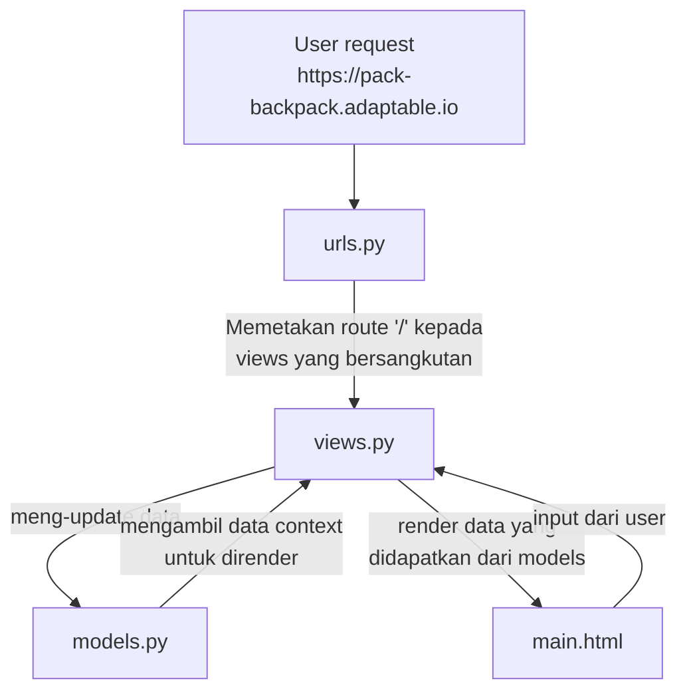

# Pack's Backpack

## Link Adaptable

<https://pack-backpack.adaptable.app/>

## Checklists

- [x] Membuat sebuah proyek Django baru.
- [x] Membuat aplikasi dengan nama main pada proyek tersebut.
- [x] Melakukan routing pada proyek agar dapat menjalankan aplikasi main.
- [x] Membuat model pada aplikasi main dengan nama Item dan memiliki atribut wajib sebagai berikut.
- name sebagai nama item dengan tipe CharField.
- amount sebagai jumlah item dengan tipe IntegerField.
- description sebagai deskripsi item dengan tipe TextField.
- [x] Membuat sebuah fungsi pada views.py untuk dikembalikan ke dalam sebuah template HTML yang menampilkan nama aplikasi serta nama dan kelas kamu.
- [x] Membuat sebuah routing pada urls.py aplikasi main untuk memetakan fungsi yang telah dibuat pada views.py.
- [x] Melakukan deployment ke Adaptable terhadap aplikasi yang sudah dibuat sehingga nantinya dapat diakses oleh teman-temanmu melalui Internet.
- [x] Membuat sebuah README.md yang berisi tautan menuju aplikasi Adaptable yang sudah di-deploy, serta jawaban dari beberapa pertanyaan berikut.
- Jelaskan bagaimana cara kamu mengimplementasikan checklist di atas secara step-by-step (bukan hanya sekadar mengikuti tutorial).
- Buatlah bagan yang berisi request client ke web aplikasi berbasis Django beserta responnya dan jelaskan pada bagan tersebut kaitan antara urls.py, views.py, models.py, dan berkas html.
- Jelaskan mengapa kita menggunakan virtual environment? Apakah kita tetap dapat membuat aplikasi web berbasis Django tanpa menggunakan virtual environment?
- Jelaskan apakah itu MVC, MVT, MVVM dan perbedaan dari ketiganya.

## Pengimplementasian Checklist

- ### Membuat proyek Django baru

  - Membuat direktori `pack_backpack`
  - Membuat virtual environment
  - Membuat & mengaktifkan virtual environment
  - Menginstall Django dan beberapa dependencies
  - Menjalankan command `django-admin startproject pack_backpack`
  - Menambahkan "*" pada `ALLOWED_HOSTS` di `settings.py`

- ### Membuat aplikasi `main` pada proyek `pack_backpack`
  
  - Menjalankan command `python manage.py startapp main` untuk membuat aplikasi `main`
  - Mendaftarkan aplikasi `main` pada proyek dengan menambahkannya di variabel `INSTALLED_APPS` pada `/pack_backpack/settings.py`
  - Membuat direktori `templates` untuk memuat semua template yang akan digunakan pada aplikasi
  - Membuat `main.html` di dalam direktori `templates` yang isinya sebagai berikut:

    ```html
    <!DOCTYPE html>
    <html lang="en">
      <head>
        <meta charset="UTF-8" />
        <meta name="viewport" content="width=device-width, initial-scale=1.0" />
        <title>Pack's Backpack</title>
      </head>
      <body>
        <h1>Pack's Backpack</h1>
        <p>Nama: {{ name }}</p>
        <p>Kelas: {{ class }}</p>
      </body>
    </html>
    ```

    Perhatikan bahwa `name` dan `class` merupakan variabel yang akan kita definisikan di `views.py`

  - Mendefinisikan `name` dan `class` pada `views.py`
  
  ```python
  ...
  def show_main(request):
    context = {
        'name': 'Ahmad Fatih Faizi',
        'class': 'PBP B'
    }

    return render(request, "main.html", context)
  ...
  ```

- ### Melakukan routing

  - buat file `urls.py` baru di dalam direktori `main` yang berisi:

  ```python
  from django.urls import path
  from main.views import show_main

  app_name = 'main'

  urlpatterns = [
      path('', show_main, name='show_main'),
  ]
  ```

  Perhatikan bahwa di sini kita memetakan route "/" kepada fungsi `show_main` yang terdapat di `views.py`. Sehingga ketika user mengakses route "/", variabel-variabel yang telah didefinisikan pada fungsi `show_main` akan di-render.

  - Import `include` ke `urls.py` pada direktori proyek
  
  ```python
  ...
  from django.urls import include
  ...
  ```
  
  - Menambahkan route pada variabel `urlpatterns` di `urls.py`

  ```python
  urlpatterns = [
    ...
    path('', include('main.urls')),
    ...
  ]
  ```

  Di sini kita memetakan route "/" kepada `urls.py` pada `main`. Sehingga ketika user mengakses route "/", route yang telah didefinisikan di `urls.py` pada `main` akan berjalan.

  Perhatikan juga bahwa route `urls.py` pada `main` akan relatif terhadap route yang didefinisikan pada `urls.py` proyek.

- ### Deployment

  - Membuat app baru di Adaptable
  - Menghubungkan repository `pack_backpack` ke Adaptable
  - Deploy aplikasi

## Bagan Struktur & Cara Kerja Django



## Mengapa menggunakan virtual environment?

Virtual environment berguna jika kita mempunyai banyak proyek python yang memiliki dependencies dengan versi yang berbeda-beda. Dengan menggunakan virtual environment, kita bisa "mengisolasi" satu versi dari suatu dependency tanpa memengaruhi dependency yang sama pada proyek lain, sehingga semua proyek tetap bisa dijalankan walaupun dependency-nya memiliki versi yang berbeda-beda.

Kita bisa saja membuat proyek Django tanpa menggunakan virtual environment, tetapi jika kita memiliki beberapa proyek dengan dependency yang sama, maka dependency tersebut harus memiliki versi yang sama.

## MVT, MVC, MVVM

MVT, MVC, dan MVVM merupakan beberapa dari banyak software arcitecture pattern. Architecture pattern membuat codebase mudah di-maintain dengan menerapkan aturan-aturan baku dalam struktur kode, dan menerapkan "separation of concerns".

### MVT (Model View Template)

- Model

  Komponen yang menyimpan dan me-maintain data pada aplikasi.

- View

  Merupakan komponen yang menjadi antarmuka pengguna (UI)

- Template

  Merupakan komponen static yang menjadi dasar dari View untuk ditambahkan data-data dinamis.

### MVC (Model View Controller)

- Model

  Merupakan komponen yang menyimpan data.

- View

  Merupakan komponen yang menjadi antarmuka pengguna (UI)
  
- Controller

  Komponen yang mengontrol data flow dari Model dan View

### MVVM (Model View Viewmodel)

  - Model

    Komponen yang me-maintain data bersama dengan Viewmodel

  - View

    Merupakan komponen yang menjadi antarmuka pengguna (UI)

  - Viewmodel

    Komponen yang mengontrol data flow dari Model dan View. Viewmodel meneruskan data-data yang akan dirender kepada View
