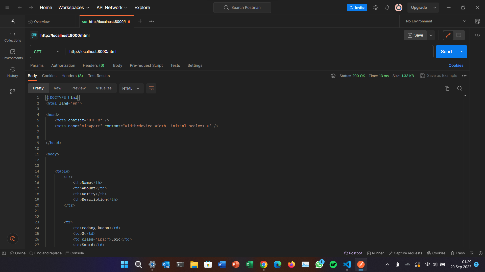
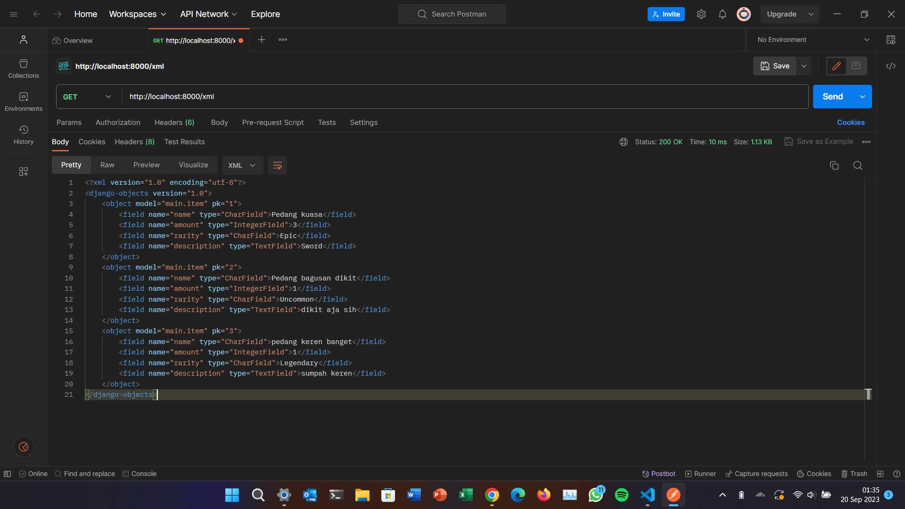
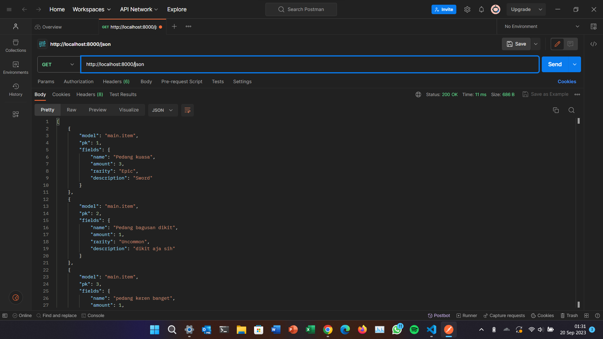
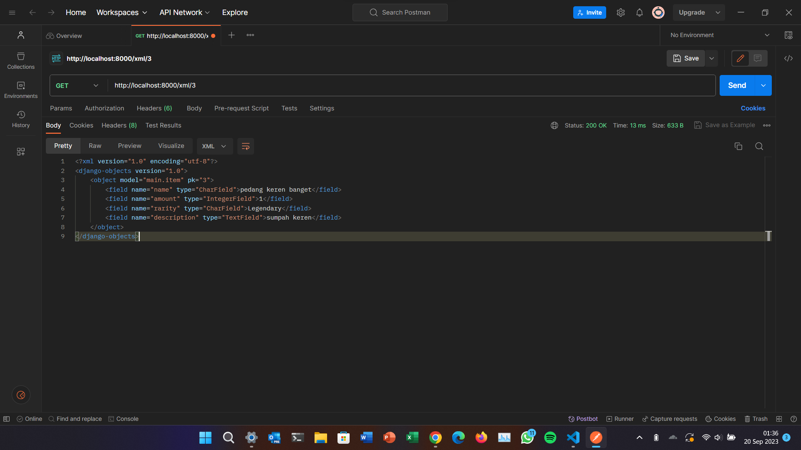
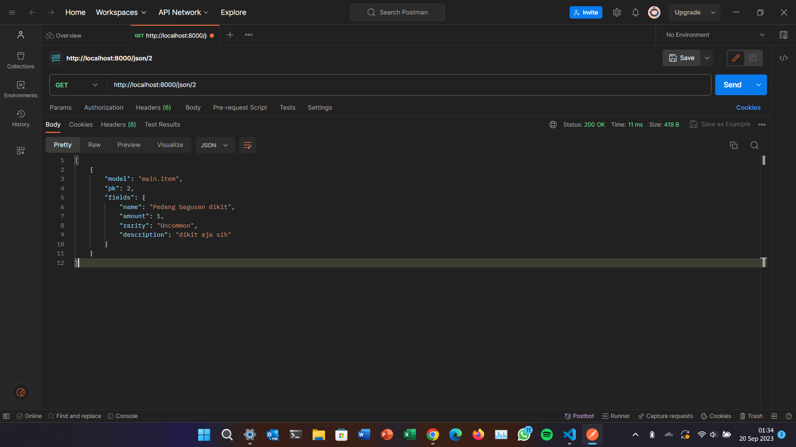
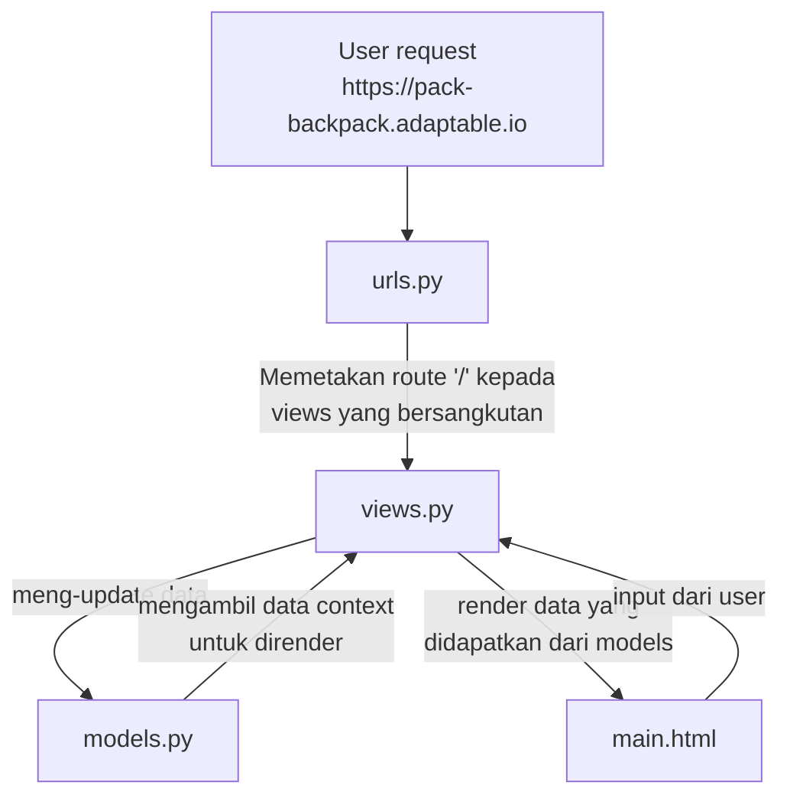

# Pack's Backpack

---

# Tugas 4

- [x] Mengimplementasikan fungsi registrasi, login, dan logout untuk memungkinkan pengguna untuk mengakses aplikasi sebelumnya dengan lancar.

- [x] Membuat dua akun pengguna dengan masing-masing tiga dummy data menggunakan model yang telah dibuat pada aplikasi sebelumnya untuk setiap akun di lokal.

- [x] Menghubungkan model Item dengan User.

- [x] Menampilkan detail informasi pengguna yang sedang logged in seperti username dan menerapkan cookies seperti last login pada halaman utama aplikasi.

- [x] Menjawab beberapa pertanyaan berikut pada README.md pada root folder (silakan modifikasi README.md yang telah kamu buat sebelumnya; tambahkan subjudul untuk setiap tugas).

  - [x] Apa itu Django UserCreationForm, dan jelaskan apa kelebihan dan kekurangannya?

  - [x] Apa perbedaan antara autentikasi dan otorisasi dalam konteks Django, dan mengapa keduanya penting?

  - [x] Apa itu cookies dalam konteks aplikasi web, dan bagaimana Django menggunakan cookies untuk mengelola data sesi pengguna?

  - [x] Apakah penggunaan cookies aman secara default dalam pengembangan web, atau apakah ada risiko potensial yang harus diwaspadai?

  - [x] Jelaskan bagaimana cara kamu mengimplementasikan checklist di atas secara step-by-step (bukan hanya sekadar mengikuti tutorial).

## Pengimplementasian Checklist

### Membuat fitur registrasi, login, dan logout

- Membuat file HTML baru pada `main/templates` dengan nama `register.html` yang berisi:

  ```html
  

  
  <title>Register</title>
  

  

  <div class="login">

    <h1>Register</h1>

    <form method="POST">
      
      <table>
        {{ form.as_table }}
        <tr>
          <td></td>
          <td><input type="submit" name="submit" value="Register" /></td>
        </tr>
      </table>
    </form>

    
    <ul>
      
      <li>{{ message }}</li>
      
    </ul>
    

  </div>

  
  ```

- Membuat file HTML baru pada `main/templates` dengan nama `login.html` yang berisi:

  ```html
  

  
  <title>Login</title>
  

  

  <div class="login">

    <h1>Login</h1>

    <form method="POST" action="">
      
      <table>
        <tr>
          <td>Username: </td>
          <td><input type="text" name="username" placeholder="Username" class="form-control"></td>
        </tr>

        <tr>
          <td>Password: </td>
          <td><input type="password" name="password" placeholder="Password" class="form-control"></td>
        </tr>

        <tr>
          <td></td>
          <td><input class="btn login_btn" type="submit" value="Login"></td>
        </tr>
      </table>
    </form>

    
    <ul>
      
      <li>{{ message }}</li>
      
    </ul>
    

    New user? <a href="">Register</a>

  </div>

  
  ```

- Menambahkan kode berikut pada `main.html` di bawah tombol untuk add item

  ```html
  ...
  <br>

  <a href="">
    <button>
      Logout
    </button>
  </a>
  ...
  ```

- Import beberapa module berikut pada `main/views.py`

```python
from django.shortcuts import redirect
from django.contrib.auth.forms import UserCreationForm
from django.contrib import messages
from django.contrib.auth import authenticate, login, logout
```

- Membuat fungsi-fungsi `register`, `login_user`, dan `logout_user` pada `main/views.py`

```python
def register(request):
  form = UserCreationForm()

  if request.method == "POST":
      form = UserCreationForm(request.POST)
      if form.is_valid():
          form.save()
          messages.success(
              request, 'Your account has been successfully created!')
          return redirect('main:login')
  context = {'form': form}
  return render(request, 'register.html', context)


def login_user(request):
    if request.method == 'POST':
        username = request.POST.get('username')
        password = request.POST.get('password')
        user = authenticate(request, username=username, password=password)
        if user is not None:
            login(request, user)
            return redirect('main:show_main')
        else:
            messages.info(
                request, 'Sorry, incorrect username or password. Please try again.')
    context = {}
    return render(request, 'login.html', context)


def logout_user(request):
    logout(request)
    return redirect('main:login')

```

- Import `register`, `login_user`, `logout_user` pada `main/urls.py`

- Menambahkan routing untuk fitur-fitur tersebut pada `main/urls.py` dalam `urlpatterns`

```python
...
path('register/', register, name='register'),
path('login/', login_user, name='login'),
path('logout/', logout_user, name='logout'),
...
```

- Restriksi akses ke halaman utama

  - Import module berikut

  ```python
  from django.contrib.auth.decorators import login_required
  ```

  - Tambahkan kode berikut *tepat* di atas fungsi `show_main`

  ```python
  @login_required(login_url='/login')
  ```

### Menghubungkan model Item dengan User

- Import module berikut pada `main/models.py`

```python
from django.contrib.auth.models import User
```

- Tambahkan kode berikut pada class `Item`

```python
class Item(models.Model):
  user = models.ForeignKey(User, on_delete=models.CASCADE)
```

- Pada `main/views.py` tambahkan kode berikut pada fungsi `add_item`

```python
def add_item(request):
 form = ProductForm(request.POST or None)

 if form.is_valid() and request.method == "POST":
     product = form.save(commit=False)
     product.user = request.user
     product.save()
     return HttpResponseRedirect(reverse('main:show_main'))
 ...
```

- Ubah fungsi `show_main` sebagai berikut

```python
def show_main(request):
    items = Item.objects.filter(user=request.user)
    ...
...
```

- Lakukan migrasi model dengan perintah

```bash
python manage.py makemigrations
python manage.py migrate
```

### Membuat dua akun pengguna dengan masing-masing tiga dummy data untuk setiap akun

- Jalankan server Django dengan perintah `python manage.py runserver`

- Mengunjungi `http://127.0.0.1:8000` pada browser. Kita secara otomatis akan diarahkan ke laman login.

- Klik link `Register`

- Isi Username dengan `user1`

- Isi password dengan `8RhJk-B8uuEG65-`

- Isi kembali password untuk konfirmasi

- Klik tombol `Register`

- Mengulangi proses yang sama untuk mendaftarkan akun ke-2 dengan username `user2` dan password `xXX_GdFNt_Ma7ef`

- Tambahkan tiga data dummy untuk `user1`

- Tambahkan tiga data dummy untuk `user2`

### Menampilkan detail informasi pengguna yang sedang logged in dan last login

- Ubah `main.html` sebagai berikut

```html



<h1>Pack's Backpack</h1>

<h4>Username: {{name}}</h4>

<h4>Item(s) in your backpack: {{count}}</h4>



<br>

<a href="">
  <button>
    Add New Item to Backpack
  </button>
</a>

<br>

<a href="">
  <button>
    Logout
  </button>
</a>


```

- Ubah fungsi `show_main` sebagai berikut

```python
def show_main(request):
    items = Item.objects.filter(user=request.user)
    context = {
        'name': request.user.username,
    ...
...
```

> Kode di atas berguna untuk menampilkan username dari pengguna yang sedang logged in.

- Pada `main/views.py` import module `datetime`

- Ubah fungsi `login_user` sebagai berikut:

```python
...
if user is not None:
    login(request, user)
    response = HttpResponseRedirect(reverse("main:show_main")) 
    response.set_cookie('last_login', str(datetime.datetime.now()))
    return response
...
```

> Kode di atas berguna untuk menambahkan cookies bernama `last_login` yang menyimpan kapan terakhir kali pengguna tersebut login.

- Pada fungsi `show_main` pada variabel `context` tambahkan kode berikut

```python
...
'last_login': request.COOKIES['last_login'],
...
```

- Ubah fungsi `logout_user` menjadi berikut

```python
def logout_user(request):
    logout(request)
    response = HttpResponseRedirect(reverse('main:login'))
    response.delete_cookie('last_login')
    return response
```

- Pada `main.html` tambahkan kode berikut di antara tabel dan tombol add item

```html
...
<h5>Last login: {{ last_login }}</h5>
...
```

### Pengerjaan bonus

- Tambahkan kode berikut pada `main/views.py`

```python
def increment(request, id):
    items = Item.objects.filter(user=request.user)
    item = Item.objects.get(pk=id)
    if item in items:
        item.amount = item.amount+1
        item.save()
        return redirect('main:show_main')


def decrement(request, id):
    items = Item.objects.filter(user=request.user)
    item = Item.objects.get(pk=id)
    if item in items:
        if (item.amount == 1):
            item.delete()
        else:
            item.amount = item.amount - 1
        item.save()
        return redirect('main:show_main')


def delete(request, id):
    items = Item.objects.filter(user=request.user)
    item = Item.objects.get(pk=id)
    if item in items:
        item = Item.objects.filter(pk=id)
        item.delete()
        return redirect('main:show_main')
```

- Pada `items.html` tambahkan kode berikut setelah `<td>{{item.description}}</td>`

```html
<td>
  <button>
    <a href="/decrement/{{item.pk}}">-</a>
  </button>
  <button>
    <a href="/increment/{{item.pk}}">+</a>
  </button>
  <button>
    <a href="/delete/{{item.pk}}">
      Delete item
    </a>
  </button>
</td>
```

- Pada `main/urls.py` import `delete`, `increment`, dan `decrement`, lalu tambahkan path kepada masing-masing views

```python
...
path('delete/<int:id>/', delete, name='delete'),
path('increment/<int:id>/', increment, name='increment'),
path('decrement/<int:id>/', decrement, name='decrement'),
...
```

## Django UserCreationForm

UserCreationForm adalah module bawaan dari Django yang berfungsi untuk menghandle pembuatan user dan autentikasi user.

Kelebihannya adalah kita tidak harus membuat program dari awal untuk membuat sistem autentikasi user.

Kekurangannya adalah kita tidak bisa customize field dari user pada saat pendaftaran (misal: no. hp), dan menambahkan 2FA.

## Autentikasi vs Otorisasi

Autentikasi adalah proses untuk menentukan siapa kita.

Otorisasi adalah proses untuk menentukan apakah kita bisa mengakses sesuatu.

## Cookies

Cookies adalah penyimpanan pada browser yang pada django digunakan untuk menyimpan `session_id` dan data-data kecil lain. Cookies `session_id` digunakan oleh django untuk mengidentifikasi siapa user yang sedang mengakses web tersebut, dan data apa saja yang harus di-serve kepada user tersebut.

## Risiko penggunaan cookies

Terdapat risiko cookie hijacking, dimana seseorang dapat mencuri cookie user, termasuk `session_id` yang dapat digunakan oleh orang jahat untuk mengakses web sebagai user.

# Tugas 3

- [x] Membuat input form untuk menambahkan objek model pada app sebelumnya.
- [x] Tambahkan 5 fungsi views untuk melihat objek yang sudah ditambahkan dalam format HTML, XML, JSON, XML by ID, dan JSON by ID.
- [x] Membuat routing URL untuk masing-masing views yang telah ditambahkan pada poin 2.
- [x] Menjawab beberapa pertanyaan berikut pada README.md pada root folder.
  - [X] Apa perbedaan antara form POST dan form GET dalam Django?
  - [X] Apa perbedaan utama antara XML, JSON, dan HTML dalam konteks pengiriman data?
  - [X] Mengapa JSON sering digunakan dalam pertukaran data antara aplikasi web modern?
  - [X] Jelaskan bagaimana cara kamu mengimplementasikan checklist di atas secara step-by-step (bukan hanya sekadar mengikuti tutorial).
- [X] Mengakses kelima URL di poin 2 menggunakan Postman, membuat screenshot dari hasil akses URL pada Postman, dan menambahkannya ke dalam README.md.
- [X] Melakukan add-commit-push ke GitHub.

## Pengimplementasian Checklist

### Prerequisites
  
- Membuat folder `templates` pada rot folder.
- Membuat file `base.html` pada folder `templates` yang berisi
  
  ```HTML
  
  <!DOCTYPE html>
  <html lang="en">
      <head>
          <meta charset="UTF-8" />
          <meta
              name="viewport"
              content="width=device-width, initial-scale=1.0"
          />
          
          
      </head>

      <body>
          
          
      </body>
  </html>
  ```

- Mendaftarkan template yang baru saja dibuat pada `pack_backpack/settings.py` pada variabel `TEMPLATES`

  ```python
  ...
  TEMPLATES = [
      {
          'BACKEND': 'django.template.backends.django.DjangoTemplates',
          'DIRS': [BASE_DIR / 'templates'], # Tambahkan kode ini
          'APP_DIRS': True,
          ...
      }
  ]
  ...
  ```

- Mengubah `main/templates/main.html` menjadi:

  ```html
  

  
  <h1>Pack's Backpack</h1>

  <h4>Name: {{name}}</h4>

  <h4>Class: {{class}}</h4>

  

  <br>

  <a href="">
    <button>
      Add New Item to Backpack
    </button>
  </a>

  
  ```

  >Perhatikan bahwa kita menggunakan `` untuk memuat isi dari `items.html` ke file `main.html` untuk mengurangi code redundancy, karena content yang ditampilkan sama.

### Membuat input form

- Membuat file baru pada direktori `main` dengan nama `forms.py` yang diisi dengan kode berikut:

    ```python
    from django.forms import ModelForm
    from main.models import Item

    class ItemForm(ModelForm):
      class Meta:
          model = Item
          fields = ["name", "amount", "rarity", "description"]
    ```

    >Kode ini merupakan struktur dari form yang akan kita gunakan untuk menerima input data dari user.

    >`model` adalah model data yang akan kita gunakan pada form (Pada kasus ini adalah `Item`).

    >`fields` adalah isian apa saja yang akan ditampilkan di forms. Pada kasus ini, isian yang akan ditampilkan adalah name, amount, rarity, dan description.

  - Menambahkan beberapa import pada `main/views.py`

    ```python
    from django.http import HttpResponseRedirect
    from main.forms import ItemForm
    from django.urls import reverse
    ```
  
  - Membuat fungsi baru pada file yang sama dengan nama `add_item`

    ```python
    def add_item(request):
    form = ProductForm(request.POST or None)

    if form.is_valid() and request.method == "POST":
        form.save()
        return HttpResponseRedirect(reverse('main:show_main'))

    context = {'form': form}
    return render(request, "add_item.html", context)
    ```

    >Fungsi ini berguna untuk menampilkan page form.

  - Membuat file HTML baru dengan nama `add_item.html` pada `main/templates` yang berisi:

    ```html
     

    
    <h1>Add New Item</h1>

    <form method="POST">
        
        <table>
            {{ form.as_table }}
            <tr>
                <td></td>
                <td>
                    <input type="submit" value="Add Item"/>
                </td>
            </tr>
        </table>
    </form>

    
    ```

### Menambahkan 5 fungsi views untuk melihat objek yang sudah ditambahkan dalam format HTML, XML, JSON, XML by ID, dan JSON by ID
  
- Menambahkan beberapa import pada file `main/views.py`.

  ```python
  from main.models import Item
  from django.http import HttpResponse
  from django.core import serializers
  ```

- Menambahkan fungsi baru pada `main/views.py` yang bernama `show_items_html` yang berisi:

  ```python
  def show_items_html(request):
      items = Item.objects.all()
      context = {'items': items}

      return render(request, "items.html", context)
  ```

- Menambahkan file HTML baru bernama `items.html` pada `main/templates` yang berisi:

  ```html
  

  

  <table>
    <tr>
      <th>Name</th>
      <th>Amount</th>
      <th>Rarity</th>
      <th>Description</th>
    </tr>

    
    <tr>
      <td>{{item.name}}</td>
      <td>{{item.amount}}</td>
      <td class="{{item.rarity}}">{{item.rarity}}</td>
      <td>{{item.description}}</td>
    </tr>
    
  </table>

  <style>
    table,
    th,
    td {
      border: 1px solid black;
      border-collapse: collapse;
      text-align: center;
      table-layout: fixed;
    }

    td {
      width: 10em;
    }

    .Common {
      color: gray;
    }

    .Uncommon {
      color: green;
    }

    .Rare {
      color: blue;
    }

    .VeryRare {
      color: violet;
    }

    .Epic {
      color: orange;
    }

    .Legendary {
      color: orangered;
    }
  </style>

  
  ```

  >Di sini saya menambahkan styling menggunakan CSS untuk mempercantik tampilan web.

- Menambahkan kode berikut pada `main/views.py`

  ```python
  ...
  def show_items_html(request):
      items = Item.objects.all()
      context = {'items': items}
      return render(request, "items.html", context)


  def show_items_xml(request):
      items = Item.objects.all()
      return HttpResponse(serializers.serialize("xml", items), content_type="application/xml")


  def show_items_xml_by_id(request, id):
      item = Item.objects.filter(pk=id)
      return HttpResponse(serializers.serialize("xml", item), content_type="application/xml")

  def show_items_json(request):
      items = Item.objects.all()
      return HttpResponse(serializers.serialize("json", items), content_type="application/json")

  def show_items_json_by_id(request, id):
      item = Item.objects.filter(pk=id)
      return HttpResponse(serializers.serialize("json", item), content_type="application/json")
  ...
  ```

  > Perhatikan bahwa pada fungsi `show_items_xml_by_id` dan `show_items_json_by_id` kita menggunakan method `filter` untuk melakukan pencarian item dengan `id` yang sesuai.

### Routing URL

- Meng-import fungsi-fungsi yang sudah kita buat di `main/views.py` pada `main/urls.py`

  ```python
  from main.views import show_main, add_item, show_items_html, show_items_xml, show_items_json, show_items_xml_by_id, show_items_json_by_id
  ```

- Menambahkan kode berikut pada `main/urls.py` pada `urlpatterns`
  
  ```python
  ...
  path('add-item/', add_item, name='add_item'),
  path('html/', show_items_html, name='show_items_html'),
  path('xml/', show_items_xml, name='show_items_xml'),
  path('json/', show_items_json, name='show_items_json'),
  path('xml/<int:id>/', show_items_xml_by_id, name='show_items_xml_by_id'),
  path('json/<int:id>/', show_items_json_by_id, name='show_items_json_by_id'),
  ...
  ```

### Pengerjaan poin BONUS

- Menambahkan kode berikut pada `main/views.py` pada `context` di fungsi `show_main`

```python
...
'count': items.count()
...
```

- Menambahkan kode berikut pada `main/templates/main.html`

```html
...
<h4>Item(s) in your backpack: {{count}}</h4>
...
```

## Perbedaan antara form GET dan form POST dalam Django

Perbedaan yang paling terlihat antara GET dan POST adalah, GET menyematkan data yang akan disubmit ke dalam URL, sedangkan POST tidak, POST akan menyematkan data yang akan disubmit pada HTTP message body.

## Perbedaan utama antara XML, JSON, dan HTML dalam konteks pengiriman data

Pada dasarnya ketiga format tersebut bisa digunakan untuk transmisi data, tetapi terdapat perbedaan fundamental pada ketiga format tersebut.

HTML digunakan untuk tranmisi data yang akan digunakan untuk tampilan web, sedangkan XML dan JSON adalah format yang digunakan untuk transmisi data.

XML menggunakan sintaks yang kurang lebih sama seperti HTML. XML menggunakan nested tag untuk mendefinisikan hirarki. Kita bisa menambahkan comment di XML

JSON menggunakan sintaks seperti object javascript (key value pair). JSON menggunakan nested object untuk mendefinisikan hirarki. Kita tidak bisa menambahkan comment pada JSON.

## Mengapa JSON sering digunakan dalam pertukaran data antara aplikasi web modern?
Karena JSON di-support oleh banyak bahasa dan framework, ringan, dan human readable. JSON terintegrasi dengan Javascript (Bahasa yang populer digunakan untuk web development). JSON secara performa parsing juga lebih cepat jika dibandingkan dengan XML.

## Screenshot Postman

### HTML



### XML



### JSON



### XML by id



### JSON by id



---

# Tugas 2

- [x] Membuat sebuah proyek Django baru.
- [x] Membuat aplikasi dengan nama main pada proyek tersebut.
- [x] Melakukan routing pada proyek agar dapat menjalankan aplikasi main.
- [x] Membuat model pada aplikasi main dengan nama Item dan memiliki atribut wajib sebagai berikut.
- name sebagai nama item dengan tipe CharField.
- amount sebagai jumlah item dengan tipe IntegerField.
- description sebagai deskripsi item dengan tipe TextField.
- [x] Membuat sebuah fungsi pada views.py untuk dikembalikan ke dalam sebuah template HTML yang menampilkan nama aplikasi serta nama dan kelas kamu.
- [x] Membuat sebuah routing pada urls.py aplikasi main untuk memetakan fungsi yang telah dibuat pada views.py.
- [x] Melakukan deployment ke Adaptable terhadap aplikasi yang sudah dibuat sehingga nantinya dapat diakses oleh teman-temanmu melalui Internet.
- [x] Membuat sebuah README.md yang berisi tautan menuju aplikasi Adaptable yang sudah di-deploy, serta jawaban dari beberapa pertanyaan berikut.
- Jelaskan bagaimana cara kamu mengimplementasikan checklist di atas secara step-by-step (bukan hanya sekadar mengikuti tutorial).
- Buatlah bagan yang berisi request client ke web aplikasi berbasis Django beserta responnya dan jelaskan pada bagan tersebut kaitan antara urls.py, views.py, models.py, dan berkas html.
- Jelaskan mengapa kita menggunakan virtual environment? Apakah kita tetap dapat membuat aplikasi web berbasis Django tanpa menggunakan virtual environment?
- Jelaskan apakah itu MVC, MVT, MVVM dan perbedaan dari ketiganya.

## Pengimplementasian Checklist

- ### Membuat proyek Django baru

  - Membuat direktori `pack_backpack`
  - Membuat virtual environment
  - Membuat & mengaktifkan virtual environment
  - Menginstall Django dan beberapa dependencies
  - Menjalankan command `django-admin startproject pack_backpack`
  - Menambahkan "*" pada `ALLOWED_HOSTS` di `settings.py`

- ### Membuat aplikasi `main` pada proyek `pack_backpack`
  
  - Menjalankan command `python manage.py startapp main` untuk membuat aplikasi `main`
  - Mendaftarkan aplikasi `main` pada proyek dengan menambahkannya di variabel `INSTALLED_APPS` pada `/pack_backpack/settings.py`
  - Membuat direktori `templates` untuk memuat semua template yang akan digunakan pada aplikasi
  - Membuat `main.html` di dalam direktori `templates` yang isinya sebagai berikut:

    ```html
    <!DOCTYPE html>
    <html lang="en">
      <head>
        <meta charset="UTF-8" />
        <meta name="viewport" content="width=device-width, initial-scale=1.0" />
        <title>Pack's Backpack</title>
      </head>
      <body>
        <h1>Pack's Backpack</h1>
        <p>Nama: {{ name }}</p>
        <p>Kelas: {{ class }}</p>
      </body>
    </html>
    ```

    Perhatikan bahwa `name` dan `class` merupakan variabel yang akan kita definisikan di `views.py`

  - Mendefinisikan `name` dan `class` pada `views.py`
  
  ```python
  ...
  def show_main(request):
    context = {
        'name': 'Ahmad Fatih Faizi',
        'class': 'PBP B'
    }

    return render(request, "main.html", context)
  ...
  ```

- ### Melakukan routing

  - buat file `urls.py` baru di dalam direktori `main` yang berisi:

  ```python
  from django.urls import path
  from main.views import show_main

  app_name = 'main'

  urlpatterns = [
      path('', show_main, name='show_main'),
  ]
  ```

  Perhatikan bahwa di sini kita memetakan route "/" kepada fungsi `show_main` yang terdapat di `views.py`. Sehingga ketika user mengakses route "/", variabel-variabel yang telah didefinisikan pada fungsi `show_main` akan di-render.

  - Import `include` ke `urls.py` pada direktori proyek
  
  ```python
  ...
  from django.urls import include
  ...
  ```
  
  - Menambahkan route pada variabel `urlpatterns` di `urls.py`

  ```python
  urlpatterns = [
    ...
    path('', include('main.urls')),
    ...
  ]
  ```

  Di sini kita memetakan route "/" kepada `urls.py` pada `main`. Sehingga ketika user mengakses route "/", route yang telah didefinisikan di `urls.py` pada `main` akan berjalan.

  Perhatikan juga bahwa route `urls.py` pada `main` akan relatif terhadap route yang didefinisikan pada `urls.py` proyek.

- ### Deployment

  - Membuat app baru di Adaptable
  - Menghubungkan repository `pack_backpack` ke Adaptable
  - Deploy aplikasi

## Bagan Struktur & Cara Kerja Django



## Mengapa menggunakan virtual environment?

Virtual environment berguna jika kita mempunyai banyak proyek python yang memiliki dependencies dengan versi yang berbeda-beda. Dengan menggunakan virtual environment, kita bisa "mengisolasi" satu versi dari suatu dependency tanpa memengaruhi dependency yang sama pada proyek lain, sehingga semua proyek tetap bisa dijalankan walaupun dependency-nya memiliki versi yang berbeda-beda.

Kita bisa saja membuat proyek Django tanpa menggunakan virtual environment, tetapi jika kita memiliki beberapa proyek dengan dependency yang sama, maka dependency tersebut harus memiliki versi yang sama.

## MVT, MVC, MVVM

MVT, MVC, dan MVVM merupakan beberapa dari banyak software arcitecture pattern. Architecture pattern membuat codebase mudah di-maintain dengan menerapkan aturan-aturan baku dalam struktur kode, dan menerapkan "separation of concerns".

### MVT (Model View Template)

- Model

  Komponen yang menyimpan dan me-maintain data pada aplikasi.

- View

  Merupakan komponen yang menjadi antarmuka pengguna (UI)

- Template

  Merupakan komponen static yang menjadi dasar dari View untuk ditambahkan data-data dinamis.

### MVC (Model View Controller)

- Model

  Merupakan komponen yang menyimpan data.

- View

  Merupakan komponen yang menjadi antarmuka pengguna (UI)
  
- Controller

  Komponen yang mengontrol data flow dari Model dan View

### MVVM (Model View Viewmodel)

- Model

    Komponen yang me-maintain data bersama dengan Viewmodel

- View

    Merupakan komponen yang menjadi antarmuka pengguna (UI)

- Viewmodel

    Komponen yang mengontrol data flow dari Model dan View. Viewmodel meneruskan data-data yang akan dirender kepada View
